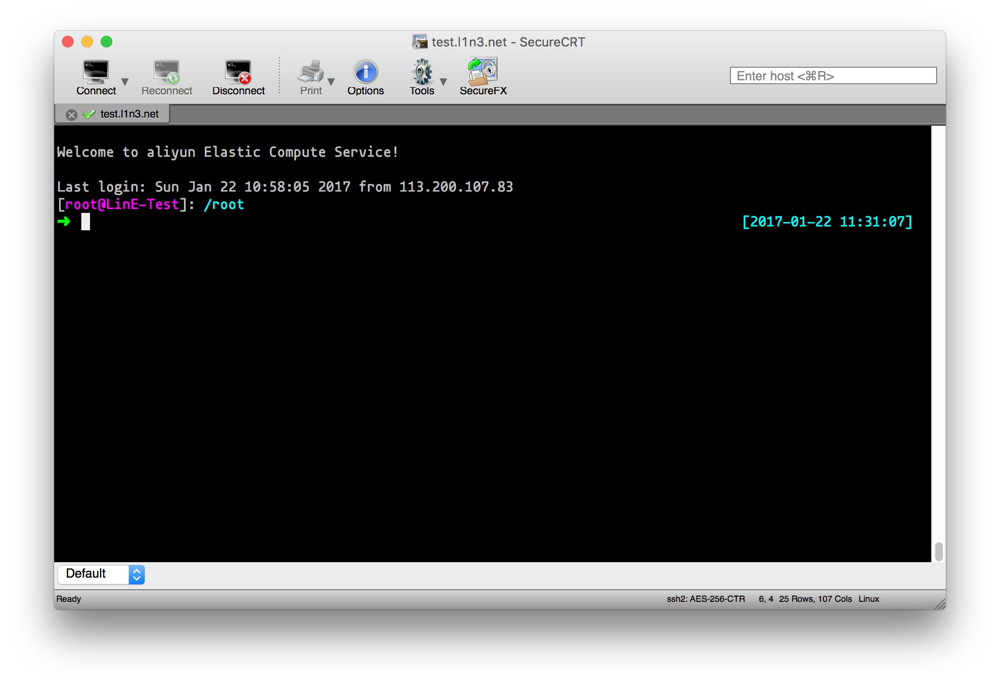
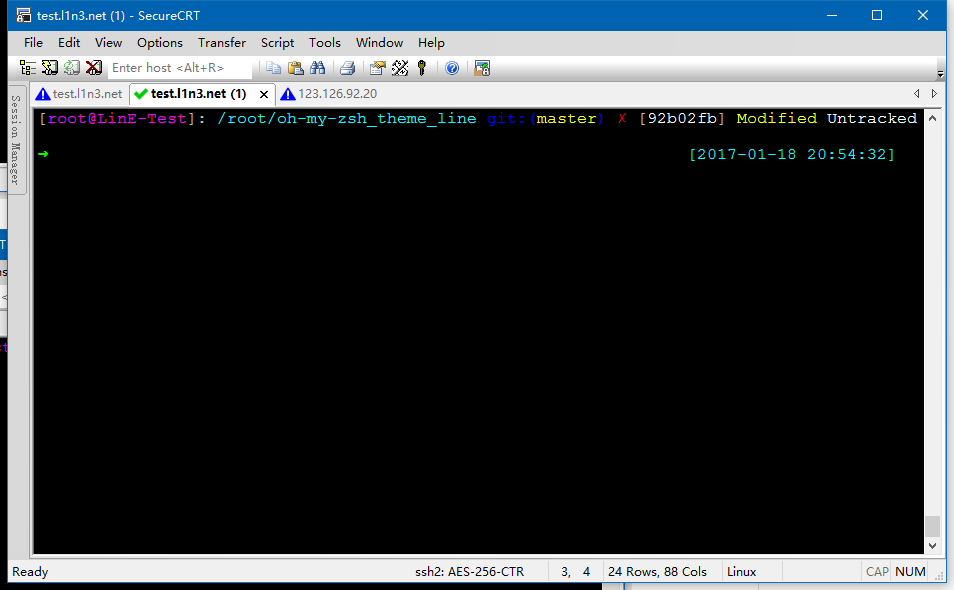
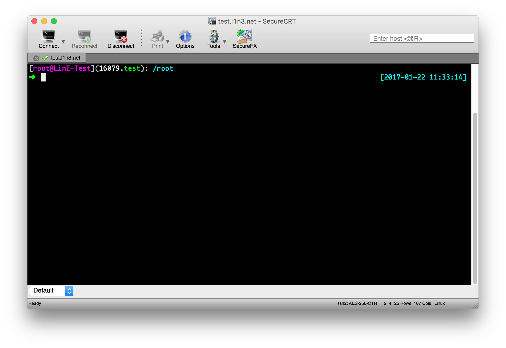

##Install
一条命令搞定 oh-my-zsh

###基于wget
```
sh -c "$(wget https://raw.githubusercontent.com/yw9381/oh-my-zsh_theme_line/master/install_zsh.sh -O -)"```

###基于curl
```
sh -c "$(curl -fsSL https://raw.githubusercontent.com/yw9381/oh-my-zsh_theme_line/master/install_zsh.sh)"
```

##如何设置
修改家目录下.zshrc这个文件(```vim ~/.zshrc```)，将
```
ZSH_THEME="xxxx"
```

改为
```
ZSH_THEME="line"
```
即可

##相关截图
主界面  
  
git信息查看  
  
screen信息  



